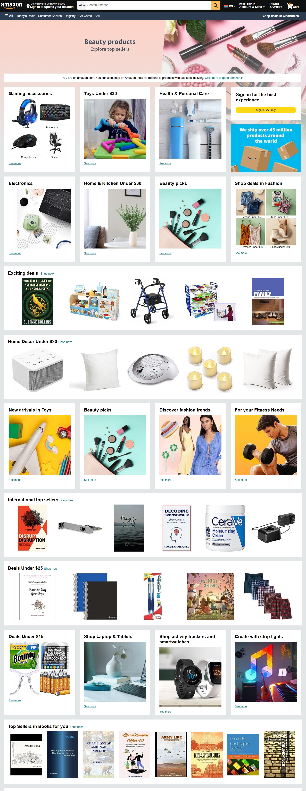

# 🛒 Amazon Home Page Clone
A fully responsive front-end clone of the Amazon home page, built using only HTML and CSS. This project is designed to mimic the layout, design, and visual components of the official Amazon.com homepage for UI/UX practice and front-end development.

## 🔗 Live Demo
👉 [View Live Site](https://yashgupta7373.github.io/Amazon-Home-Page-Clone/)

## 📂 GitHub Repository
👉 [GitHub Repo](https://github.com/yashgupta7373/Amazon-Home-Page-Clone)

## 🛠️ Technologies Used
- HTML5
- CSS3

## 📸 Screenshot


## ✨ Features
- Clean and responsive Amazon-style layout
- Grid-based product cards and categories
- Navigation bar with search bar and cart icon
- Promotional banners and featured deals section
- Organized with semantic HTML elements and styled components

## 🚫 Limitations
- No JavaScript used (No interactivity or dynamic content)
- Not connected to any backend or real database

## 🚀 How to Run
1. Clone the repository:
   ```bash
   git clone https://github.com/yashgupta7373/Amazon-Home-Page-Clone.git
2. Open index.html in your browser.

📌 Purpose
This project was created to practice front-end layout building and HTML/CSS skills by recreating a real-world commercial website interface.

Made with ❤️ by Yash Gupta